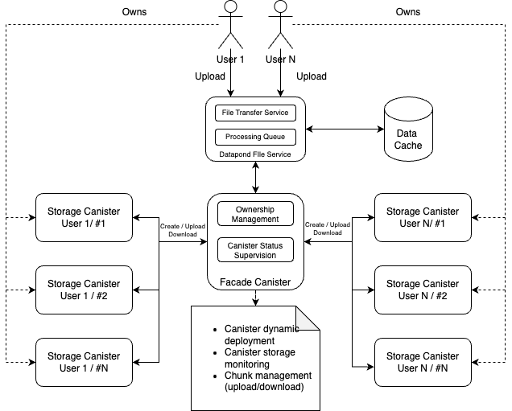

# icp-datapond-integration-resources

## Overview

This folder provides a demonstration of an authentication setup using the IIAuthHook module, which exposes specific methods for internet identity authentication. The IIAuthHook is utilized within a React context, abstracted through a custom hook, and employed in the `LoginPage.tsx` component for internet identity-based login.

## Files and Structure

- **`IIAuthHook.ts`**: Contains the IIAuthHook module, a custom hook exposing methods for internet identity authentication.
- **`LoginPage.tsx`**: Demonstrates the usage of the IIAuthHook within a React context for implementing internet identity-based login.

## Architecture Diagram

The architecture diagram provides an overview of the ICP integration with DataPond AI, showcasing the interaction between services and canisters.
